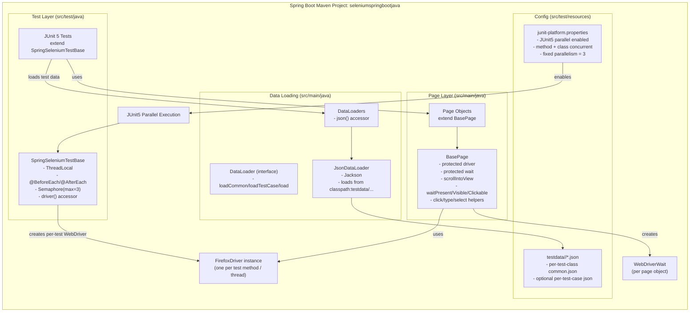

# Architecture (Current) – seleniumspringbootjava

This file describes the **current state** of the Spring Boot-based automation framework solution.

> Update this file whenever you introduce major changes: driver lifecycle, parallel execution model, base utilities, page structure, test structure, reporting/CI, etc.

## High-level view (current architecture)

This describes the current architecture implemented in this repository.

## Current implementation status

- Spring Boot project scaffold: ✅
- Selenium dependency added: ✅
- JUnit 5 parallel execution: ✅ (`src/test/resources/junit-platform.properties`)
- Driver lifecycle: ✅ one WebDriver per test method (`SpringSeleniumTestBase`)
- Browser concurrency limit: ✅ max 3 browsers (Semaphore in `SpringSeleniumTestBase`)
- Page Object model: ✅ (`BasePage` + site-specific pages)
- Test suites: ✅ DemoBlaze + The-Internet Herokuapp
- Test data: ✅ JSON per test class (classpath `testdata/<TestClassSimpleName>/common.json`) via `DataLoaders.json()`

## Key design decisions

### 1) One WebDriver per test method

Each test method gets a fresh `FirefoxDriver`. This avoids shared mutable state and allows method-level parallelism safely.

### 2) Parallelism is controlled by JUnit 5 (not Surefire)

Surefire uses the JUnit Platform provider. Parallel settings live in `junit-platform.properties`.

### 3) Hard max browser cap = 3

Even if JUnit parallelism is increased, the framework will not exceed 3 browsers due to a `Semaphore(3)` around driver creation.

### 4) Page objects are instantiated per test method

Tests create page objects with the current method’s driver, avoiding Spring proxying issues with WebDriver interfaces (e.g., `JavascriptExecutor`).

### 5) Test data is loaded from classpath resources (JSON)

Test data is stored under `src/test/resources/testdata/...` and loaded using the generic data-loader abstraction located in `src/main/java`:

- `DataLoader` interface (extendable to other formats in future)
- `JsonDataLoader` implementation (Jackson)
- `DataLoaders` accessor (central place to retrieve loader instances)

## Notes

These are real external-site UI tests. Occasional flakiness can still occur due to network/site behavior.
